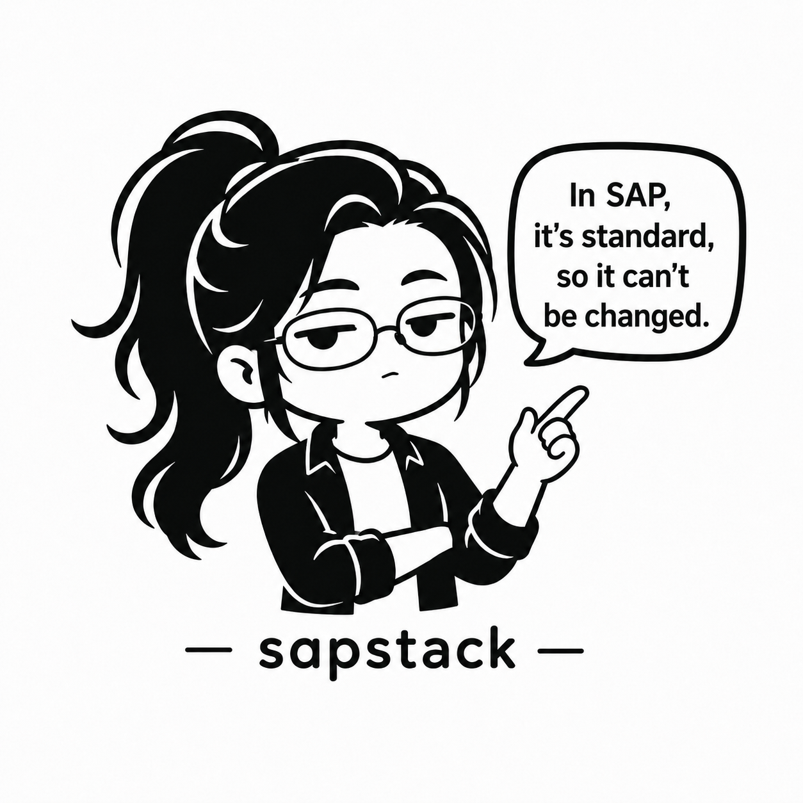

<div align="center">

# 🏛 sapstack



_"In SAP, it's standard, so it can't be changed." — Ms. Standard ([brand guide](MASCOT.md))_

### The AI Desktop for SAP Operations

**Install it and just ask — from standard processes to your company's custom (Z/Y) programs.**

[](https://www.npmjs.com/package/@boxlogodev/sapstack-mcp)
[](https://github.com/BoxLogoDev/sapstack/releases)
[](LICENSE)
[](#)

**Windows desktop app v2.5.0 · 24 plugins · 21 agents · 23 commands · CBO snapshots · air-gap ready · 6 languages · compliance ready**

🌐 [🇰🇷 한국어](README.md) · [🇬🇧 English](README.en.md) · [🇨🇳 中文](README.zh.md) · [🇯🇵 日本語](README.ja.md) · [🇩🇪 Deutsch](README.de.md) · [🇻🇳 Tiếng Việt](README.vi.md)

</div>

---

## What is sapstack?

**sapstack** is a **dedicated SAP AI desktop app** for business users and consultants.
No ADT, no developer authorizations, no API key of your own — open the app and type a question.

```
"The F110 payment run fails"          → 4-turn Evidence Loop (hypothesis→evidence→verify→rollback)
"What's the month-end closing order?" → Period-end sequence with T-codes and menu paths
"What does program ZFI0042 do?"       → Reads your company's custom code (CBO snapshot) and explains it
```

Underneath sits SAP knowledge covering the full operations lifecycle
(**Configure → Implement → Operate → Diagnose → Optimize**) — 24 module plugins, IMG guides,
Best Practices, and compliance — and the same knowledge is available from Claude Code, MCP,
and VS Code (→ [Integrations for developers & power users](#-integrations-for-developers--power-users)).

> Decision principles live in [**ETHOS.md**](ETHOS.md) — ground truth · evidence first · no hardcoding · ECC≠S/4 · field terminology · the operator decides.

---

## 👥 Who it's for

| You are… | The sapstack desktop gives you |
|---|---|
| **SAP business user** (chasing a deadline, no developer rights) | Type a question on the home screen — incidents route to the **4-turn Evidence Loop**, factual questions get direct answers. Your **company's Z/Y programs** are explained from a snapshot (no guessing, snapshot date always disclosed). |
| **Administrator / IT** | **Zero-config rollout** with a single `provision.yaml` — end users unzip and run the exe, done. CBO snapshots collect nightly, publish to a network share, and the app refreshes itself. Air-gapped sites run on the bundled local LLM. |
| **SAP consultant / partner** | 24 modules of knowledge + IMG configuration + 3-tier Best Practices + compliance, in the desktop and in your AI tools — quickly adapted per client environment. |

---

## 🖥 What the desktop does

### 💬 Start with one question
Type into the home screen — incidents branch into the **Evidence Loop**
(INTAKE→HYPOTHESIS→COLLECT→VERIFY, falsification criteria and rollback pairs required),
factual questions get a **Quick Advisory**. Example-question chips help you copy a first question.

### 🗂 CBO snapshots — ask about your company's custom code
An administrator exports custom ABAP (Z/Y) sources into a snapshot; the app reads that copy
**without connecting to SAP** and answers "what does this program do?" in business language.
Three delivery channels — bundled in the distribution ZIP · auto-refresh from a network share ·
"Import from ZIP" in Settings. Every answer discloses the **snapshot date**.
→ [docs/cbo-snapshot.md](docs/cbo-snapshot.md)

### 📦 Zero-config mass rollout (admin provisioning)
Ship one `provision.yaml` next to the exe and the first launch auto-configures the LLM connection
(company key, gateway, or local model), the SAP environment, and worker mode — **end users never
see a setup screen.** Key rotation is just a version bump and redistribution.
→ [docs/provisioning.md](docs/provisioning.md)

### 🙋 Worker mode
A simple, question-first home (3 cards + example chips), developer menus hidden, no tool-approval
prompts (read-only by default). Toggle under Settings → Appearance.

### 🔒 Air-gapped (isolated network) support
Bundles the `llama-server` (llama.cpp) local inference engine — bring GGUF model packs in on USB
and it runs without internet. With `air_gapped: true`, crash reporting and update polling are
disabled entirely. → [docs/compliance/air-gapped-deployment.md](docs/compliance/air-gapped-deployment.md)

### 📚 The SAP knowledge underneath (the basis of every answer)
- **24 modules**: FI · CO · TR · MM · SD · PP · HCM · PM · QM · WM · EWM · ABAP · BASIS · BTP · SFSF · S4Mig · GTS · BC · Cloud PE · Session and more
- **21 agents**: 16 module consultants + ABAP developer + Integration/S4 migration advisors + SAP tutor (onboarding) + **CBO explainer** (custom-code explanations for business users)
- **IMG configuration framework**: 76 SPRO-based guides (ECC vs S/4 differences, verification steps)
- **3-tier Best Practices**: Operational · Period-End · Governance
- **6 languages**: 한국어 · English · 中文 · 日本語 · Deutsch · Tiếng Việt (24 modules × 5 language quick guides)
- **Compliance**: K-SOX · SOC 2 · ISO 27001 · GDPR · automatic PII masking

---

## ✅ See it work

**Scenario 1**: _"MIGO goods receipt posting keeps failing."_ — the Evidence Loop narrows by evidence instead of asserting.

```
Turn 1 · INTAKE      Environment first: ECC (EhP?) / S/4 (release?), movement type (MvT),
                     full error message (M7 xxx).
Turn 2 · HYPOTHESIS  Hypothesis A: posting period not open — check: does the current period
                     in MMRV match the posting date? (falsified → discard A)
                     Hypothesis B: movement type / account determination (OBYC) — check: …
Turn 3 · COLLECT     (the operator checks MMRV and reports back)
Turn 4 · VERIFY      Period mismatch confirmed → Fix: roll the period with MMPV (simulate
                     first, via Transport). Rollback plan + related SAP Note pointers included.
```

**Scenario 2**: _"What does ZFI0042 do?"_ — answered from the CBO snapshot (fictional example), in this format:

```
One-line summary   (program purpose derived from the snapshot's source header/catalog)
Where it's used    Screens and buttons (if the T-code mapping is outside the snapshot, it says so)
Processing flow    Authorization check → query → list/print — the actual flow read from source
Watch out for      Messages a business user will see and what to do (no guessing — if it's
                   not in the snapshot, the answer says so)
As of              This answer is based on the YYYY-MM-DD snapshot.
```

> Every hypothesis carries a **falsification criterion**, every fix a **rollback plan**. Guidance only, no direct production changes — the operator decides. (→ [ETHOS](ETHOS.md))

---

## Quick start

### 🖥 Desktop (recommended — business users & consultants)

**Got a distribution ZIP?** Unzip and run `sapstack-Desktop-*-Portable-x64.exe` — done.
(If your admin bundled a provision.yaml, you can ask questions with zero setup screens.)

**Installing yourself**: grab `sapstack-Desktop-<version>-Setup-x64.exe` (NSIS, per-user, no
admin rights) or the Portable variant from [GitHub Releases](https://github.com/BoxLogoDev/sapstack/releases).
Git for Windows (Git Bash) is required; about 249MB (measured on v2.4.1).
→ Install: [docs/desktop-install.md](docs/desktop-install.md) · Packaging: [docs/provisioning.md](docs/provisioning.md)

**Three SAP data paths** — none of them modifies SAP:
① paste-based by default ② read-only ADT bridge (Settings > SAP connection, [docs/adt-bridge.md](docs/adt-bridge.md))
③ CBO snapshots (offline copy, [docs/cbo-snapshot.md](docs/cbo-snapshot.md))

### ⚡ 5-minute onboarding (repository-based)
```bash
git clone https://github.com/BoxLogoDev/sapstack.git && cd sapstack
./setup.sh        # Windows: ./setup.ps1   ·   check only: ./setup.sh --check
```
Details: [docs/quickstart-5min.md](docs/quickstart-5min.md)

---

## 🔧 Integrations for developers & power users

Other entrances to the same SAP knowledge.

### Claude Code
```bash
/plugin marketplace add https://github.com/BoxLogoDev/sapstack
/plugin install sap-fi@sapstack sap-session@sapstack
```

### NPM (MCP server) — 23 tools + 12 prompts + 9 resources
```bash
npm install -g @boxlogodev/sapstack-mcp
sapstack-mcp --sessions-dir ~/.sapstack/sessions
```

### VS Code Extension
Search "sapstack" in the VS Code Marketplace → Install · (or install the `.vsix` directly from a [GitHub Release](https://github.com/BoxLogoDev/sapstack/releases))

### Amazon Kiro IDE
```bash
git submodule add https://github.com/BoxLogoDev/sapstack sapstack
cp sapstack/.kiro/settings/mcp.json .kiro/settings/
cp sapstack/.kiro/steering/*.md .kiro/steering/
```

### Others (Codex / Copilot / Cursor / Continue.dev / Aider)
Clone the repository → auto-detected. Details: [docs/multi-ai-compatibility.md](docs/multi-ai-compatibility.md)

### 🧭 Golden Path — what to use when
Full guide: [docs/workflow.md](docs/workflow.md)

| You want | The path |
|---|---|
| A quick factual answer | **Quick Advisory** — just ask |
| Incident diagnosis | **Evidence Loop** (4 turns) → module consultant / symptom commands |
| To understand a custom (Z/Y) program | Ask on the desktop home / `/sap-cbo-explain` |
| You don't know the module | `sap-tutor` (classifies, then delegates to a specialist) |
| A configuration (IMG) issue | `/sap-img-guide` |
| Period-end closing | `/sap-fi-closing` → `/sap-quarter-close` → `/sap-year-end` |

---

## Universal Rules

1. **Never hardcode** — no fixed company codes, G/L accounts, or org units
2. **Environment intake first** — SAP release, deployment model, company code
3. **ECC vs S/4HANA distinguished explicitly** — version-specific behavior spelled out
4. **Transport required** — production changes always go through Transports
5. **Simulate first** — AFAB, F.13, FAGL_FC_VAL, MR11, F110, etc.
6. **No SE16N editing** — never recommend direct data edits in production
7. **T-code + SPRO path** — both provided for every action
8. **Korean uses field terminology first** — dual notation like "코스트 센터 (원가센터, KOSTL)"

> The *why* behind these rules: [**ETHOS.md**](ETHOS.md) · full operating rules: [CLAUDE.md](CLAUDE.md).

---

## Learning path

| Level | Path |
|------|------|
| 🆕 **Getting started** | [Tutorial (15 min)](docs/tutorial.md) → [FAQ](docs/faq.md) |
| 🖥 **Desktop operations** | [Install](docs/desktop-install.md) → [Provisioning](docs/provisioning.md) → [CBO snapshots](docs/cbo-snapshot.md) → [US pilot runbook](docs/en/us-pilot-runbook.md) |
| 📘 **Hands-on** | [5 scenarios](docs/scenarios/) → [Glossary](docs/glossary.md) |
| 🧭 **Workflow** | [Golden Path](docs/workflow.md) → [Completeness gap analysis](docs/gstack-gap-analysis.md) |
| 🏗 **Deep dive** | [Architecture](docs/architecture.md) → [Multi-AI guide](docs/multi-ai-compatibility.md) |
| 🔒 **Security** | [SECURITY.md](SECURITY.md) → [Compliance](docs/compliance/) |
| 🤝 **Contributing** | [CONTRIBUTING](CONTRIBUTING.md) → [Roadmap](docs/roadmap.md) |

---

## Data assets

| Asset | Count | File |
|------|------|------|
| Verified T-codes | 472 | [`data/tcodes.yaml`](data/tcodes.yaml) |
| Natural-language symptom index | 90 (6 languages) | [`data/symptom-index.yaml`](data/symptom-index.yaml) |
| Verified SAP Notes/KBAs | 112 | [`data/sap-notes.yaml`](data/sap-notes.yaml) |
| Multilingual synonyms | 80+ terms × 6 langs | [`data/synonyms.yaml`](data/synonyms.yaml) |
| Period-end sequence | 24 steps | [`data/period-end-sequence.yaml`](data/period-end-sequence.yaml) |
| Industry matrix | 7 industries | [`data/industry-matrix.yaml`](data/industry-matrix.yaml) |

---

## Plugin catalog

| Area | Plugins |
|------|----------|
| 💰 **Finance** | [sap-fi](plugins/sap-fi/) · [sap-co](plugins/sap-co/) · [sap-tr](plugins/sap-tr/) |
| 📦 **Logistics** | [sap-mm](plugins/sap-mm/) · [sap-sd](plugins/sap-sd/) · [sap-pp](plugins/sap-pp/) · [sap-pm](plugins/sap-pm/) · [sap-qm](plugins/sap-qm/) · [sap-wm](plugins/sap-wm/) · [sap-ewm](plugins/sap-ewm/) |
| 👥 **HR** | [sap-hcm](plugins/sap-hcm/) · [sap-sfsf](plugins/sap-sfsf/) |
| 💻 **Technical** | [sap-abap](plugins/sap-abap/) · [sap-s4-migration](plugins/sap-s4-migration/) · [sap-btp](plugins/sap-btp/) · [sap-basis](plugins/sap-basis/) · [sap-cloud](plugins/sap-cloud/) |
| ☁️ **Cloud/Integration** | [sap-ibp](plugins/sap-ibp/) · [sap-sac](plugins/sap-sac/) · [sap-ariba](plugins/sap-ariba/) · [sap-integration-cloud](plugins/sap-integration-cloud/) |
| 🇰🇷 **Korea/Global** | [sap-bc](plugins/sap-bc/) · [sap-gts](plugins/sap-gts/) |
| 🔁 **Meta** | [sap-session](plugins/sap-session/) (Evidence Loop) |

---

## Translation review contributions

The quick guides in 5 languages (en/zh/ja/de/vi) are **Claude-written drafts**. Reviews by native speakers with SAP domain expertise are very welcome.

- Process, criteria, PR format: **[docs/TRANSLATION-REVIEW.md](docs/TRANSLATION-REVIEW.md)**
- Feedback: [Translation Feedback issue](https://github.com/BoxLogoDev/sapstack/issues/new?template=translation-feedback.md)
- T-codes and Note numbers are not translated (keep verbatim)

---

## License & contributing

**MIT License** — free for commercial and non-commercial use. Keep the copyright notice.

- 🐛 [Bug report](https://github.com/BoxLogoDev/sapstack/issues/new?template=bug_report.md)
- ✨ [Feature request](https://github.com/BoxLogoDev/sapstack/issues/new?template=feature_request.md)
- 💬 [Discussions](https://github.com/BoxLogoDev/sapstack/discussions)
- 📖 [Contributing guide](CONTRIBUTING.md)

---

<div align="center">

**Made with 🇰🇷 by [@BoxLogoDev](https://github.com/BoxLogoDev)**
Built for Korean SAP consultants · Shared with the global community

</div>
